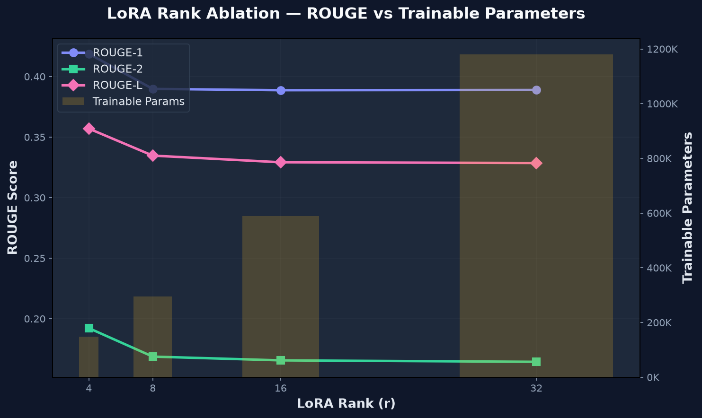

<div align="center">

# 🧬 LoRA Fine-Tuning — Dialogue Summarization

**Parameter-efficient fine-tuning of T5 for customer service dialogue summarization using Low-Rank Adaptation (LoRA)**

[](https://python.org)
[](https://huggingface.co/docs/transformers)
[](https://huggingface.co/docs/peft)
[](LICENSE)
[](https://github.com/lucianoon/lora-tweetsumm/actions/workflows/ci.yml)

</div>

---

## 📋 Overview

This project demonstrates **parameter-efficient fine-tuning** of Google's T5 model for abstractive summarization of customer service dialogues from the [TweetSumm](https://huggingface.co/datasets/Andyrasika/TweetSumm-tuned) dataset.

Instead of updating all ~60M parameters, we use **LoRA (Low-Rank Adaptation)** to train only **~0.5%** of the model weights while achieving strong summarization quality — making the approach practical even on consumer hardware (Apple M-series, single GPU).

### Key Highlights

- 🎯 **< 0.25% trainable parameters** — rank-4 LoRA achieves the best results with only 147K params
- ⚡ **~53 seconds training** on Apple M4 (MPS) with 300 samples
- 📊 **ROUGE-L = 0.357** with the optimal rank-4 configuration
- 🔀 **rsLoRA scaling** (Kalajdzievski 2023) for training stability across ranks
- 🧪 **Rank ablation study** showing diminishing returns beyond r=4

### Portfolio Snapshot

This repository is structured as an end-to-end applied ML project:

- **Training pipeline:** configurable T5 + LoRA fine-tuning with HuggingFace Trainer
- **Evaluation:** ROUGE metrics, baseline comparison, and per-sample predictions
- **Experimentation:** automated LoRA rank ablation with plots and JSON artifacts
- **Deployment demo:** local Gradio app with trained adapter loading
- **Engineering hygiene:** typed config dataclasses, tests, linting, CI, Dockerfile

---

## 🏗️ Architecture

```
┌─────────────────────────────────────────────────────────────┐
│                    T5-Small (60M params)                     │
│                                                             │
│  ┌──────────┐    ┌──────────┐    ┌──────────┐              │
│  │ Encoder  │───▶│ Decoder  │───▶│  LM Head │──▶ Summary   │
│  │ (frozen) │    │ (frozen) │    │ (frozen) │              │
│  └────┬─────┘    └────┬─────┘    └──────────┘              │
│       │               │                                     │
│  ┌────▼─────┐    ┌────▼─────┐                              │
│  │ LoRA Δq  │    │ LoRA Δq  │   r=4, α=16                 │
│  │ LoRA Δv  │    │ LoRA Δv  │   ~147K trainable params     │
│  └──────────┘    └──────────┘                              │
│                                                             │
│  W' = W_frozen + (α/√r) · B·A    ← rsLoRA scaling         │
└─────────────────────────────────────────────────────────────┘
```

---

## 🚀 Quick Start

### Prerequisites

- Python 3.10+
- macOS (MPS), Linux (CUDA), or CPU

### Installation

```bash
# Clone the repository
git clone https://github.com/lucianoon/lora-tweetsumm.git
cd lora-tweetsumm

# Create virtual environment
python -m venv .venv
source .venv/bin/activate

# Install dependencies
pip install -e .

# (Optional) Install Gradio for the demo UI
pip install -e ".[demo]"
```

### Train

```bash
# Run with default configuration (300 samples, 3 epochs, ~1 min on M4)
python -m scripts.train

# Use a custom config
python -m scripts.train --config configs/default.yaml

# Train and merge adapters into base model
python -m scripts.train --merge
```

### Evaluate

```bash
# Compute ROUGE scores with the latest checkpoint under training.output_dir
python -m scripts.evaluate

# Evaluate a specific trained adapter checkpoint
python -m scripts.evaluate --checkpoint checkpoints/t5-lora-tweetsumm/checkpoint-225

# Compare fine-tuned model against base T5 (no LoRA)
python -m scripts.evaluate --baseline
```

### Demo

```bash
# Launch interactive Gradio UI
python -m scripts.demo

# Launch with a specific trained adapter checkpoint
python -m scripts.demo --checkpoint checkpoints/t5-lora-tweetsumm/checkpoint-225

# Launch even if no checkpoint exists (clearly marked as untrained in the UI)
python -m scripts.demo --allow-untrained

# Create a public shareable link (72h)
python -m scripts.demo --share
```

The demo defaults are optimized for local responsiveness: translation is off,
`num_beams=1`, and `max_new_tokens=48`. Enable PT↔EN translation only when
needed, because it loads additional translation models.

---

## 📁 Project Structure

```
lora-tweetsumm/
├── README.md                 # This file
├── pyproject.toml            # Dependencies & project metadata (PEP 621)
├── Dockerfile                # Container for reproducible runs
├── LICENSE                   # MIT License
│
├── configs/
│   ├── default.yaml          # Full training config (r=4, 300 samples)
│   ├── fast.yaml             # Quick iteration (100 samples, 1 epoch)
│   └── t5-base.yaml          # T5-Base for higher quality experiments
│
├── src/
│   ├── __init__.py           # Package metadata
│   ├── config.py             # YAML-based configuration dataclasses
│   ├── data.py               # Dataset loading & tokenization
│   ├── model.py              # T5 + LoRA model construction & stats
│   ├── train.py              # Seq2SeqTrainer setup & execution (with timing)
│   └── inference.py          # Summary generation utilities
│
├── scripts/
│   ├── train.py              # Training entrypoint
│   ├── evaluate.py           # ROUGE evaluation with baseline comparison
│   ├── experiments.py        # Rank ablation experiments & visualization
│   └── demo.py               # Gradio interactive demo
│
├── tests/                    # Unit & integration test suite
│   ├── conftest.py           # Shared fixtures
│   ├── test_config.py        # Configuration tests
│   ├── test_data.py          # Data pipeline tests
│   ├── test_model.py         # Model construction tests (slow)
│   └── test_inference.py     # Inference tests (slow)
│
├── notebooks/
│   └── exploration.ipynb     # Narrative walkthrough & analysis
│
└── results/                  # Saved evaluation metrics & plots
```

---

## ⚙️ Configuration

All hyperparameters are centralized in YAML config files:

| Parameter | Default | Fast | Description |
|-----------|---------|------|-------------|
| `model_id` | `google-t5/t5-small` | same | Base model (swap to `t5-base` for quality) |
| `n_train` | `300` | `100` | Training samples (max 879) |
| `lora.r` | `4` | `8` | LoRA rank (4 is optimal per ablation) |
| `lora.alpha` | `16` | `16` | LoRA scaling factor |
| `lora.use_rslora` | `true` | `true` | Rank-stabilized scaling (α/√r) |
| `training.epochs` | `3` | `1` | Number of training epochs |
| `training.learning_rate` | `1e-3` | `1e-3` | Higher lr typical for LoRA |

Create a new YAML file to experiment with different configurations without modifying code.

### Hardware Tested

| Hardware | Memory | Device | Config | Training Time |
|----------|--------|--------|--------|---------------|
| MacBook Air M4 | 16 GB unified | MPS | T5-small, r=4, 300 samples, 3 epochs | ~53s |

For this hardware class, `google-t5/t5-base` is a practical next step.
`flan-t5-large` may run with LoRA, but requires smaller batches and longer
iteration time.

---

## 📊 Results

### Rank Ablation (T5-Small, 300 samples, 3 epochs)

| Rank | Trainable Params | % of Total | ROUGE-1 | ROUGE-2 | ROUGE-L | Train Time |
|------|-----------------|------------|---------|---------|---------|------------|
| **r=4** 🏆 | **147,456** | **0.24%** | **0.4188** | **0.1922** | **0.3570** | **53.1s** |
| r=8 | 294,912 | 0.48% | 0.3898 | 0.1687 | 0.3347 | 53.2s |
| r=16 | 589,824 | 0.97% | 0.3887 | 0.1656 | 0.3292 | 52.2s |
| r=32 | 1,179,648 | 1.91% | 0.3889 | 0.1644 | 0.3286 | 56.6s |

> **Key insight:** r=4 achieves the best ROUGE scores with the fewest trainable parameters (0.24%).
> Higher ranks show diminishing returns — suggesting the task's underlying structure is well-captured by a rank-4 decomposition.
>
> Model: `google-t5/t5-small` · α=16 · rsLoRA · 3 epochs · lr=1e-3 · Apple M4 (MPS)

<p align="center">
  
</p>

---

## 🧪 Experiments

### Rank Ablation

Compare the effect of different LoRA ranks on summarization quality:

```bash
# Full ablation: r=4, 8, 16, 32 (default)
python -m scripts.experiments

# Custom ranks
python -m scripts.experiments --ranks 4 8 16

# Fast mode (100 samples, 1 epoch) for quick iteration
python -m scripts.experiments --fast

# Combine: specific ranks + fast config
python -m scripts.experiments --ranks 4 8 16 32 --fast
```

The experiment script automatically:
1. Trains a separate model for each rank
2. Evaluates ROUGE scores on the test set
3. Collects parameter counts and training time
4. Saves each rank's checkpoints under `training.output_dir/rank-<r>/`
5. Saves results to `results/rank_ablation_<timestamp>.json`
6. Generates a comparison chart at `results/rank_ablation.png`

**Example output:**

```
══════════════════════════════════════════════════════════════════════════════════
  LoRA Rank Ablation — Results Summary
══════════════════════════════════════════════════════════════════════════════════
  Rank  │     Params  │      %  │  ROUGE-1  │  ROUGE-2  │  ROUGE-L  │  Time(s)
────────────────────────────────────────────────────────────────────────────────
  r=4   │    147,456  │  0.24%  │   0.4188  │   0.1922  │   0.3570  │    53.1s
  r=8   │    294,912  │  0.48%  │   0.3898  │   0.1687  │   0.3347  │    53.2s
  r=16  │    589,824  │  0.97%  │   0.3887  │   0.1656  │   0.3292  │    52.2s
  r=32  │  1,179,648  │  1.91%  │   0.3889  │   0.1644  │   0.3286  │    56.6s
══════════════════════════════════════════════════════════════════════════════════

  🏆 Best rank by ROUGE-L: r=4 (ROUGE-L=0.3570)
```

---

## 🔬 Technical Details

### Why LoRA?

Full fine-tuning updates all model parameters, requiring significant memory and compute. LoRA ([Hu et al., 2021](https://arxiv.org/abs/2106.09685)) decomposes weight updates into low-rank matrices:

$$W' = W + \Delta W = W + B \cdot A$$

where $B \in \mathbb{R}^{d \times r}$ and $A \in \mathbb{R}^{r \times d}$, with rank $r \ll d$.

### rsLoRA Scaling

We use rank-stabilized LoRA ([Kalajdzievski, 2023](https://arxiv.org/abs/2312.03732)) which scales the adapter output by $\alpha / \sqrt{r}$ instead of $\alpha / r$, providing more stable training dynamics across different rank values.

### Target Modules

LoRA adapters are applied to the **query (q)** and **value (v)** projections of the multi-head attention layers in both the encoder and decoder, following the original LoRA paper's recommendation.

---

## 🧪 Testing

```bash
# Run fast tests (no model downloads, ~2 seconds)
pytest -m "not slow"

# Run all tests including model integration tests (~30 seconds)
pytest

# Run with coverage
pytest --cov=src --cov-report=html
```

Tests are organized by module: `test_config.py` (pure logic), `test_data.py` (mock datasets), `test_model.py` and `test_inference.py` (marked `@slow`, load real T5-small).

---

## ⚠️ Limitations

- The main experiments use a small subset of TweetSumm (`n_train=300`) for fast
  local iteration, not maximum model quality.
- ROUGE is useful for quick comparison, but it does not fully capture factuality,
  actionability, or customer-service usefulness.
- Portuguese demo support is translation-based. The summarizer itself is trained
  on English-style TweetSumm data.
- Checkpoints and generated result files are intentionally gitignored. Re-run
  training or experiments to recreate them locally.
- Apple MPS support is improving quickly across PyTorch and Transformers; exact
  runtime can vary by package version.

---

## 🐳 Docker

```bash
# Build the image
docker build -t lora-tweetsumm .

# Run the Gradio demo.
# In a clean clone, this starts with an untrained adapter unless you mount checkpoints.
docker run -p 7860:7860 lora-tweetsumm

# Run the demo with local trained checkpoints mounted into the container
docker run -p 7860:7860 \
  -v "$PWD/checkpoints:/app/checkpoints" \
  lora-tweetsumm \
  python -m scripts.demo --checkpoint checkpoints/t5-lora-tweetsumm/checkpoint-225

# Run training instead
docker run lora-tweetsumm python -m scripts.train

# Run experiments
docker run lora-tweetsumm python -m scripts.experiments --fast
```

---

## 📓 Notebooks

The [`notebooks/exploration.ipynb`](notebooks/exploration.ipynb) notebook provides a narrative walkthrough of the entire project:

1. **Dataset exploration** — length distributions, sample dialogues
2. **LoRA explained** — parameter comparison visualizations
3. **Training** — live training with before/after comparison
4. **Evaluation** — ROUGE scores and example predictions
5. **Ablation analysis** — interactive charts from experiment results

---

## 📚 References

1. **LoRA**: Hu, E. J., et al. (2021). [LoRA: Low-Rank Adaptation of Large Language Models](https://arxiv.org/abs/2106.09685). *arXiv:2106.09685*.
2. **rsLoRA**: Kalajdzievski, D. (2023). [A Rank Stabilization Scaling Factor for Fine-Tuning with LoRA](https://arxiv.org/abs/2312.03732). *arXiv:2312.03732*.
3. **T5**: Raffel, C., et al. (2020). [Exploring the Limits of Transfer Learning with a Unified Text-to-Text Transformer](https://arxiv.org/abs/1910.10683). *JMLR*.
4. **PEFT**: HuggingFace. [Parameter-Efficient Fine-Tuning](https://huggingface.co/docs/peft).
5. **TweetSumm**: Dataset for customer service dialogue summarization.

---

## 📄 License

This project is licensed under the MIT License — see the [LICENSE](LICENSE) file for details.
