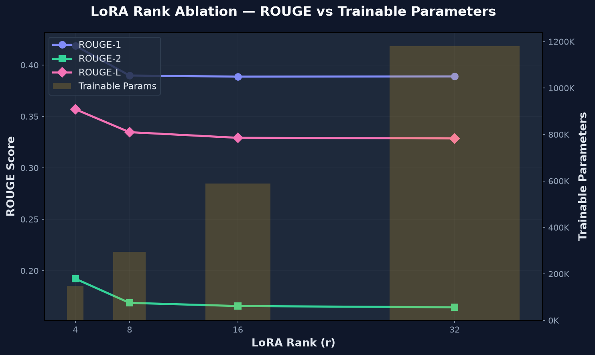

<div align="center">

# 🧬 Fine-Tuning com LoRA — Sumarização de Diálogos

**Fine-tuning eficiente em parâmetros do T5 para sumarização de diálogos de atendimento ao cliente usando Low-Rank Adaptation (LoRA)**

[](https://python.org)
[](https://huggingface.co/docs/transformers)
[](https://huggingface.co/docs/peft)
[](LICENSE)
[](https://github.com/lucianoon/lora-tweetsumm/actions/workflows/ci.yml)
[](https://huggingface.co/spaces/lucianoon/lora-tweetsumm-demo)

</div>

*[English version](README.en.md)*

---

## 📋 Visão geral

Este projeto demonstra **fine-tuning eficiente em parâmetros** do modelo T5 da Google para sumarização abstrativa de diálogos de atendimento ao cliente do dataset [TweetSumm](https://huggingface.co/datasets/Andyrasika/TweetSumm-tuned).

Em vez de atualizar todos os ~60M de parâmetros, usamos **LoRA (Low-Rank Adaptation)** para treinar apenas **~0,5%** dos pesos do modelo, mantendo boa qualidade de sumarização — o que torna a abordagem viável até em hardware de consumidor (Apple série M, GPU única).

### Destaques

- 🎯 **< 0,25% de parâmetros treináveis** — LoRA com rank 4 obtém o melhor resultado com apenas 147K parâmetros
- ⚡ **~53 segundos de treino** em Apple M4 (MPS) com 300 amostras
- 📊 **ROUGE-L = 0,357** com a configuração ótima de rank 4
- 🔀 **Escalonamento rsLoRA** (Kalajdzievski 2023) para estabilidade de treino entre ranks
- 🧪 **Estudo de ablação de rank** mostrando retornos decrescentes acima de r=4

### Panorama do projeto

Este repositório está estruturado como um projeto de ML aplicado de ponta a ponta:

- **Pipeline de treino:** fine-tuning configurável de T5 + LoRA com o Trainer da HuggingFace
- **Avaliação:** métricas ROUGE, comparação com baseline e predições por amostra
- **Experimentação:** ablação automatizada de rank do LoRA, com gráficos e artefatos JSON
- **Demo de deploy:** app Gradio local carregando o adaptador treinado
- **Higiene de engenharia:** dataclasses de configuração tipadas, testes, lint, CI e Dockerfile

---

## 🏗️ Arquitetura

```
┌─────────────────────────────────────────────────────────────┐
│                    T5-Small (60M params)                     │
│                                                             │
│  ┌──────────┐    ┌──────────┐    ┌──────────┐              │
│  │ Encoder  │───▶│ Decoder  │───▶│  LM Head │──▶ Resumo    │
│  │(congel.) │    │(congel.) │    │(congel.) │              │
│  └────┬─────┘    └────┬─────┘    └──────────┘              │
│       │               │                                     │
│  ┌────▼─────┐    ┌────▼─────┐                              │
│  │ LoRA Δq  │    │ LoRA Δq  │   r=4, α=16                 │
│  │ LoRA Δv  │    │ LoRA Δv  │   ~147K params treináveis    │
│  └──────────┘    └──────────┘                              │
│                                                             │
│  W' = W_congelado + (α/√r) · B·A   ← escalonamento rsLoRA  │
└─────────────────────────────────────────────────────────────┘
```

---

## 🚀 Início rápido

Python 3.10+, em macOS (MPS), Linux (CUDA) ou CPU.

```bash
git clone https://github.com/lucianoon/lora-tweetsumm.git
cd lora-tweetsumm
python -m venv .venv && source .venv/bin/activate
pip install -e ".[demo]"        # sem [demo], não instala o Gradio

python -m scripts.train         # treina: 300 amostras, 3 épocas, ~1 min num M4
python -m scripts.evaluate      # ROUGE do checkpoint mais recente
python -m scripts.demo          # interface Gradio
```

Cada script aceita `--help`. As variações mais usadas: `train --merge` mescla os
adaptadores no modelo base, `evaluate --baseline` compara contra o T5 sem LoRA,
`evaluate --checkpoint <path>` fixa um checkpoint, e `demo --allow-untrained`
abre a interface sem checkpoint (marcando claramente como não treinado).

## 📁 Estrutura do projeto

O que não é óbvio pelo navegador de arquivos:

```
configs/
├── default.yaml       # treino completo (r=4, 300 amostras) — o padrão
├── fast.yaml          # iteração rápida (100 amostras, 1 época)
└── t5-base.yaml       # T5-Base, para experimentos de maior qualidade

scripts/               # entrypoints
├── train.py           # treino
├── evaluate.py        # ROUGE, com comparação de baseline
├── experiments.py     # ablação de rank e visualização
└── demo.py            # demo Gradio

space/                 # build do Space em Gradio (exige HF PRO)
space-static/          # Space estático: roda no navegador via Transformers.js
```

Deploy dos Spaces: [`space/DEPLOY.md`](space/DEPLOY.md). O código da biblioteca
fica em `src/` (config, data, model, train, inference).

## ⚙️ Configuração

Todos os hiperparâmetros ficam centralizados em arquivos YAML:

| Parâmetro | Padrão | Fast | Descrição |
|-----------|---------|------|-------------|
| `model_id` | `google-t5/t5-small` | igual | Modelo base (troque por `t5-base` para mais qualidade) |
| `n_train` | `300` | `100` | Amostras de treino (máx. 879) |
| `lora.r` | `4` | `8` | Rank do LoRA (4 é o ótimo segundo a ablação) |
| `lora.alpha` | `16` | `16` | Fator de escala do LoRA |
| `lora.use_rslora` | `true` | `true` | Escalonamento estabilizado por rank (α/√r) |
| `training.epochs` | `3` | `1` | Número de épocas de treino |
| `training.learning_rate` | `1e-3` | `1e-3` | Learning rate mais alto é típico em LoRA |

Crie um novo arquivo YAML para experimentar configurações diferentes sem mexer no código.

### Hardware testado

| Hardware | Memória | Device | Config | Tempo de treino |
|----------|--------|--------|--------|---------------|
| MacBook Air M4 | 16 GB unificada | MPS | T5-small, r=4, 300 amostras, 3 épocas | ~53s |

Para essa classe de hardware, `google-t5/t5-base` é um próximo passo prático.
`flan-t5-large` pode rodar com LoRA, mas exige batches menores e tempo de
iteração maior.

---

## 📊 Resultados

### Ablação de rank (T5-Small, 300 amostras, 3 épocas)

| Rank | Params treináveis | % do total | ROUGE-1 | ROUGE-2 | ROUGE-L | Tempo de treino |
|------|-----------------|------------|---------|---------|---------|------------|
| **r=4** 🏆 | **147.456** | **0,24%** | **0,4188** | **0,1922** | **0,3570** | **53,1s** |
| r=8 | 294.912 | 0,48% | 0,3898 | 0,1687 | 0,3347 | 53,2s |
| r=16 | 589.824 | 0,97% | 0,3887 | 0,1656 | 0,3292 | 52,2s |
| r=32 | 1.179.648 | 1,91% | 0,3889 | 0,1644 | 0,3286 | 56,6s |

> **Conclusão principal:** r=4 obtém os melhores scores ROUGE com o menor número de parâmetros treináveis (0,24%).
> Ranks maiores mostram retornos decrescentes — o que sugere que a estrutura subjacente da tarefa é bem capturada por uma decomposição de rank 4.
>
> Modelo: `google-t5/t5-small` · α=16 · rsLoRA · 3 épocas · lr=1e-3 · Apple M4 (MPS)

<p align="center">
  
</p>

---

## 🧪 Experimentos

### Ablação de rank

Compare o efeito de diferentes ranks do LoRA na qualidade da sumarização:

```bash
# Ablação completa: r=4, 8, 16, 32 (padrão)
python -m scripts.experiments

# Ranks customizados
python -m scripts.experiments --ranks 4 8 16

# Modo rápido (100 amostras, 1 época) para iteração ágil
python -m scripts.experiments --fast

# Combinado: ranks específicos + config rápida
python -m scripts.experiments --ranks 4 8 16 32 --fast
```

O script de experimentos automaticamente:
1. Treina um modelo separado para cada rank
2. Avalia os scores ROUGE no conjunto de teste
3. Coleta contagem de parâmetros e tempo de treino
4. Salva os checkpoints de cada rank em `training.output_dir/rank-<r>/`
5. Salva os resultados em `results/rank_ablation_<timestamp>.json`
6. Gera um gráfico comparativo em `results/rank_ablation.png`

**Exemplo de saída:**

```
══════════════════════════════════════════════════════════════════════════════════
  LoRA Rank Ablation — Results Summary
══════════════════════════════════════════════════════════════════════════════════
  Rank  │     Params  │      %  │  ROUGE-1  │  ROUGE-2  │  ROUGE-L  │  Time(s)
────────────────────────────────────────────────────────────────────────────────
  r=4   │    147,456  │  0.24%  │   0.4188  │   0.1922  │   0.3570  │    53.1s
  r=8   │    294,912  │  0.48%  │   0.3898  │   0.1687  │   0.3347  │    53.2s
  r=16  │    589,824  │  0.97%  │   0.3887  │   0.1656  │   0.3292  │    52.2s
  r=32  │  1,179,648  │  1.91%  │   0.3889  │   0.1644  │   0.3286  │    56.6s
══════════════════════════════════════════════════════════════════════════════════

  🏆 Best rank by ROUGE-L: r=4 (ROUGE-L=0.3570)
```

---

## 🔬 Detalhes técnicos

### Por que LoRA?

Fine-tuning completo atualiza todos os parâmetros do modelo, exigindo bastante memória e compute. O LoRA ([Hu et al., 2021](https://arxiv.org/abs/2106.09685)) decompõe as atualizações de peso em matrizes de baixo rank:

$$W' = W + \Delta W = W + B \cdot A$$

onde $B \in \mathbb{R}^{d \times r}$ e $A \in \mathbb{R}^{r \times d}$, com rank $r \ll d$.

### Escalonamento rsLoRA

Usamos LoRA estabilizado por rank ([Kalajdzievski, 2023](https://arxiv.org/abs/2312.03732)), que escala a saída do adaptador por $\alpha / \sqrt{r}$ em vez de $\alpha / r$, oferecendo dinâmica de treino mais estável entre diferentes valores de rank.

### Módulos alvo

Os adaptadores LoRA são aplicados às projeções de **query (q)** e **value (v)** das camadas de atenção multi-head, tanto no encoder quanto no decoder, seguindo a recomendação do paper original do LoRA.

---

## 🧪 Testes

```bash
# Rodar os testes rápidos (sem download de modelo, ~2 segundos)
pytest -m "not slow"

# Rodar todos os testes, incluindo os de integração com modelo (~30 segundos)
pytest

# Rodar com cobertura
pytest --cov=src --cov-report=html

# Lint e checagem de tipos (os mesmos gates do CI)
ruff check src/ scripts/ tests/
ruff format --check src/ scripts/ tests/
mypy
```

Os testes são organizados por módulo: `test_config.py` (lógica pura), `test_data.py` (datasets mockados), `test_model.py` e `test_inference.py` (marcados como `@slow`, carregam o T5-small de verdade).

---

## ⚠️ Limitações

- Os experimentos principais usam um subconjunto pequeno do TweetSumm
  (`n_train=300`) para iteração local rápida, não para qualidade máxima do
  modelo.
- ROUGE é útil para comparação rápida, mas não captura por completo
  factualidade, acionabilidade ou utilidade real em atendimento ao cliente.
- O suporte a português na demo é baseado em tradução. O sumarizador em si é
  treinado em dados do TweetSumm, em inglês.
- Checkpoints e arquivos de resultado gerados estão intencionalmente no
  gitignore. Rode treino ou experimentos de novo para recriá-los localmente.
- O suporte a Apple MPS evolui rápido no PyTorch e no Transformers; o tempo de
  execução exato varia conforme a versão dos pacotes.

---

## 🐳 Docker

```bash
# Construir a imagem
docker build -t lora-tweetsumm .

# Rodar a demo Gradio.
# Num clone limpo, isso inicia com adaptador não treinado, a menos que você monte checkpoints.
docker run -p 7860:7860 lora-tweetsumm

# Rodar a demo com checkpoints treinados locais montados no container
docker run -p 7860:7860 \
  -v "$PWD/checkpoints:/app/checkpoints" \
  lora-tweetsumm \
  python -m scripts.demo --checkpoint checkpoints/t5-lora-tweetsumm/checkpoint-225

# Rodar o treino em vez da demo
docker run lora-tweetsumm python -m scripts.train

# Rodar os experimentos
docker run lora-tweetsumm python -m scripts.experiments --fast
```

---

## 📓 Notebooks

O notebook [`notebooks/exploration.ipynb`](notebooks/exploration.ipynb) traz um passo a passo narrativo do projeto inteiro:

1. **Exploração do dataset** — distribuições de comprimento, diálogos de exemplo
2. **LoRA explicado** — visualizações comparando contagem de parâmetros
3. **Treino** — treino ao vivo com comparação antes/depois
4. **Avaliação** — scores ROUGE e exemplos de predições
5. **Análise de ablação** — gráficos interativos a partir dos resultados dos experimentos

O conteúdo do notebook está em inglês.

---

## 📚 Referências

1. **LoRA**: Hu, E. J., et al. (2021). [LoRA: Low-Rank Adaptation of Large Language Models](https://arxiv.org/abs/2106.09685). *arXiv:2106.09685*.
2. **rsLoRA**: Kalajdzievski, D. (2023). [A Rank Stabilization Scaling Factor for Fine-Tuning with LoRA](https://arxiv.org/abs/2312.03732). *arXiv:2312.03732*.
3. **T5**: Raffel, C., et al. (2020). [Exploring the Limits of Transfer Learning with a Unified Text-to-Text Transformer](https://arxiv.org/abs/1910.10683). *JMLR*.
4. **PEFT**: HuggingFace. [Parameter-Efficient Fine-Tuning](https://huggingface.co/docs/peft).
5. **TweetSumm**: dataset para sumarização de diálogos de atendimento ao cliente.

---

## 📄 Licença

Este projeto está licenciado sob a Licença MIT — veja o arquivo [LICENSE](LICENSE) para detalhes.
